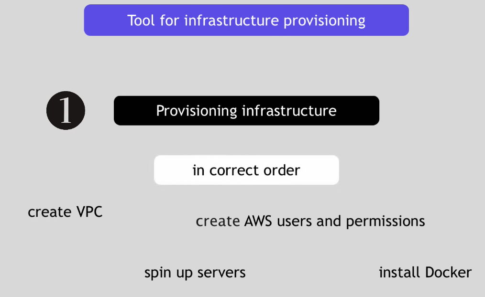
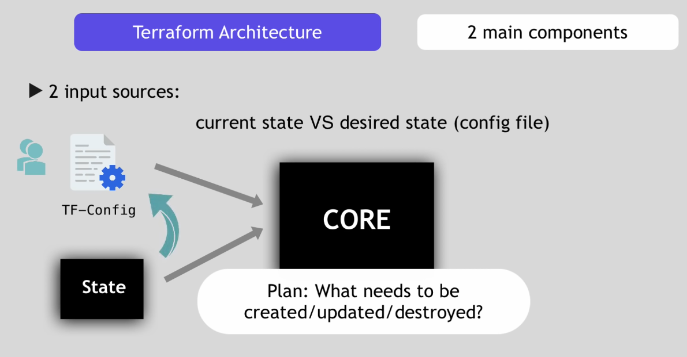
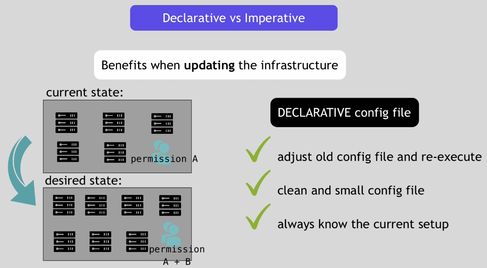

# Terraform Explained


## 1. What is Terraform?

- Terraform allows you automate and manage your Infrastructure

- and your platform

- and your services that run on that platform

- it is open source

- and it uses declarative language (you don't have to define how every step of how this automation and management is done, you just declare the end result you want and terraform will figure out to execute it, versus imperative where you specify how to execute each step)


## 2. What is Terraform used for?

- it is a tool for Infrastructure provisioning, but what does that mean?

- you just started a project where you make an Application and you want to create an Infrastructure for it where this Application will run

- how does your Infrastructure look?

- you want to spin up several servers

- where you want to deploy your five microservice Applications that makeup your Application as Docker Containers

- and also you want to deploy a Database Container.

- you decide to use AWS platform to build your whole Infrastructure on

- the first step would be to go to AWS and prepare the setup so the Application can be deployed there
- you create your Private Network Space
- you create and launch EC2 Server Instances
- you install Docker on each of those, plus any other tools that you might need
- you setup Security Groups (Firewalls), Networks, etc

- Once the Infrastructure is prepared, you can now deploy your Docker containers on that prepared infrastucture.

- So these are two separate tasks, two separate steps of creating the whole setup.

  - Provisioning Infrastructure (DevOps)

  - Deploying the Application (Software Developer)

- So where does Terraform come into this? It is used for the First Part where you Provision the Infrastructure to prepare it for the Application Deployment.

- Creating the VPC, Spinning up the Servers, Creating the Security, Creating the AWS user and Permissions, Installing Docker, etc. And all of this needs to be in the Correct Order, because one task maybe depends on the another.




## 3. Difference between Terraform and Ansible and when to use each

- What is the difference between Ansible and Terraform?

- They seem to be doing the same thing? Which one to use?

- Both: Infrastructure as Code

- Both Automate: Provisioning, Configuring, and Managing the Infastructure

- Terraform: MAINLY an Infrastructure Provisioning Tool

- Terraform: CAN also Deploy Apps on that Infrastructure

- Ansible : MAINLY a Configuration Tool, once the Infrastructure is Provisioned Ansible can Configure it and Deploy Applications, Install/Update Software on that Infrastructure

- Ansible: More Mature

- Terraform: Relatively New, More Advanced in Orchestration

- Terraform: Better for Infastructure

- Ansible: Better for Configuring that Infrastructure & Deploying Applications/Services

- DevOps Engineers use a Combination of these Tools to cover the whole setup end to end, using both for their own strength.


## 4. Managing existing Infrastructure

- Now you decide you want to add 5 more Servers to the existing Infrastructure to deploy more MicroServices

- And add some Security Configuration, or Remove something you added at the Start.

- We are in the Phase of Managing existing Infrastructure and Making Adjustments

- This is easy with Terraform to make these adjustments^

- This task is just as important, because you will be continually adjusting it and updating it, and so you need some automation tool that will do most of the heavy lifting for you.

- Replicating Infrastructure

- After you have tested this setup and everything works fine, you decide to release the Application in a Production Environment, so you want to create a Production environment that replicates the same setup, and keep the first as a development environment where you can test new features/microservice/updates BEFORE you launch it in Production.

- You can use Terraform to automate that process^ to spin up an identical Infrastructure using the same Terraform code that you use for the first setup.


## 5. How does Terraform work?

- How does Terraform connect to the Platform Provider and provision things?

- Terraform has two main components

- Terraform CORE

- CORE uses 2 input sources

  - Terraform Config File that you write, and where you define what needs to be created or rovisioned.

  - Terraform State where Terraform keeps the up to date State of how the current Setup of the Infrastructure looks like

- CORE compares the State and the Config File and makes a PLAN and figures out what needs to be done to get to that Desired State in the Config... so what needs to be created/updated/deleted and in which order on that Infrastructure Setup.




- PROVIDERS (for Specific Technologies):

  - Cloud Providers like AWS, Azuer, or other Infrastructure as a Service platforms
  - Kubernetes, or other Platform as a Service tools
  - Fastly, or other Software as a Service tools

- So it gives you the possibility to create stuff at different levels, so create a Infrastructure on AWS, create a Kubernetes Cluster, and then create Components inside of that Cluster.

- And it does that through those Providers. Terraform has over 100 providers and each provider gives user access to its resources. So AWS as an example gives you resources to EC2 etc. Kuberenetes gives you resources to Services, Deployments etc.

- So Terraform tries to help you cover the complete Application setup from Infrastructure all the way to the Application.

- Terraform's Strength is in the Infrastructure Provisioning (IaaS Providers: AWS, Azure etc) and for the other stuff (PaaS: Kubernetes, SaaS: Fastly etc) you can use Ansible or similar tools.

- Once the CORE creates an Execution Plan based on the input from Config File and State, it then uses Providers for specific Technologies to execute the Plan. To Connect to those Platforms and carry out those Execution Steps.


## 6. Example Configuration Files

- AWS Provider to Configure a VPC

```tf
# Configure AWS Provider
provider "aws" {
  version = "~> 2.0"
  region  = "us-east-1"
}

# Create a VPC
resource "aws_vpc" "example" {
  cidr_block = "10.0.0.0/16"
}
```

- Kubernetes Provider to Configure a Namespace

```
# Configure the Kubernetes Provider
provider "kubernetes" {
  config_context_auth_info = "ops"
  config_context_cluster   = "mycluster"
}

# Create a Namespace
resource "kubernetes_namespace" "example" {
  metadata {
    name = "my-first-namespace"
  }
}
```


## 7. Declarative vs Imperative

- The declarative approach that Terraform's configuration files are written in... And this is important to understand.
- What does declarative mean exactly? Instead of telling Terraform the steps to get there, you simply define the End State you desire in your Config File.

- For example:

  - I want 5 Servers with the following Network Config
  - I want an AWS User with the following Permissions

- Imperative is defining the exact steps - the How

- Declarative is defining the end result

- In the initial setup this might not make much difference

- But when you are Updating the Infrastructure

- With an Imperative Configuration file, you would need to say, remove 2 servers, add a firewall config, add permissions to AWS user

- With a Declarative Configuration file, my new desired state is 7 servers, this firewall config, and user with the following permissions

- Do whatever needs to be done to get from the current state to the new desired state

- So you don't have to calculate and figure out the steps

- The benefits are:

  - you adjust your old config file and re-execute

  - you have a clean and small config file

  - you always know the current setup just by looking at the config file




## 8. Terraform Commands

- So you have defined a Terraform Config File with your Provider and Resource, now how do you make Terraform take action

- Terraform has commands you can execute to go through Different Stages

- `refresh` - Terraform will query the Infrastructure Provider to get the Current State, so Terraform will now know what is the current State of the Infrastructure

- `plan` - Terraform will create an Execution Plan, by determinign what actions are neccessary (and in which order) to achieve the Desired State defined in the Config File. But this is just a Plan, this is where the CORE constructs what needs to be done.

- `apply` - Terraform will do a `refresh` to get the current State and then `apply` (execute) the `plan`

- `destroy` - Terraform will destroy the whole setup, removing elements one by one, in the right order and cleaning up all the resources that were created. `destroy` also does a `refresh` to check the current State and creates a `plan` of what needs to be removed and in which order.


